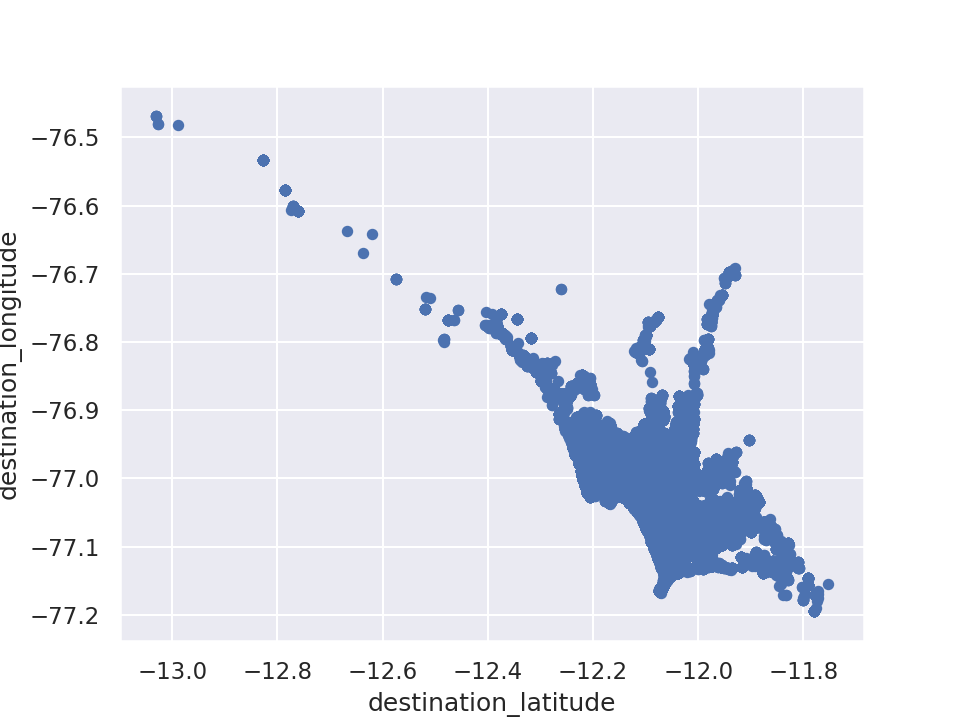
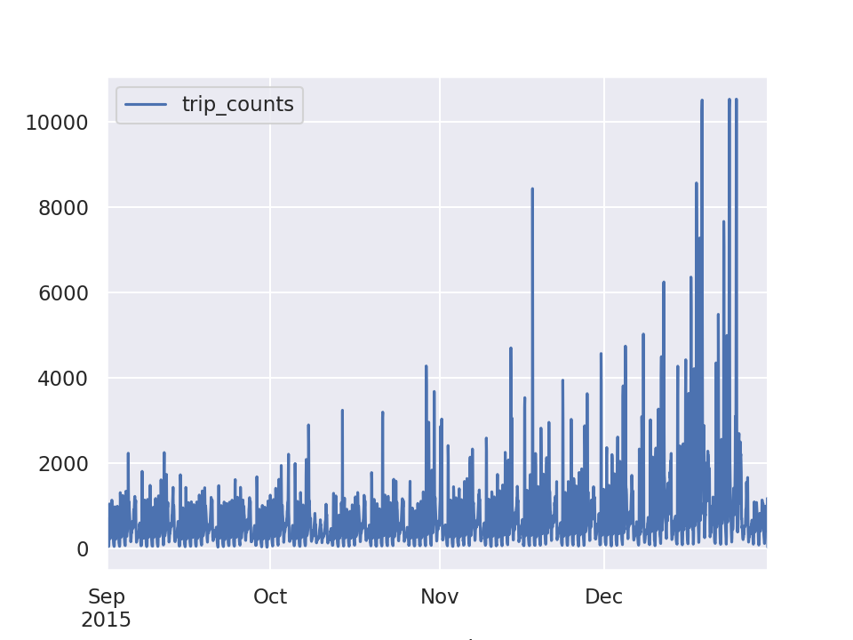
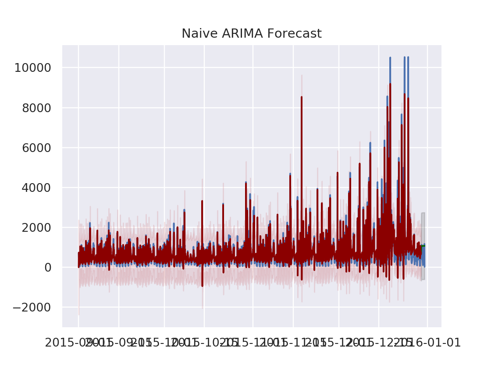
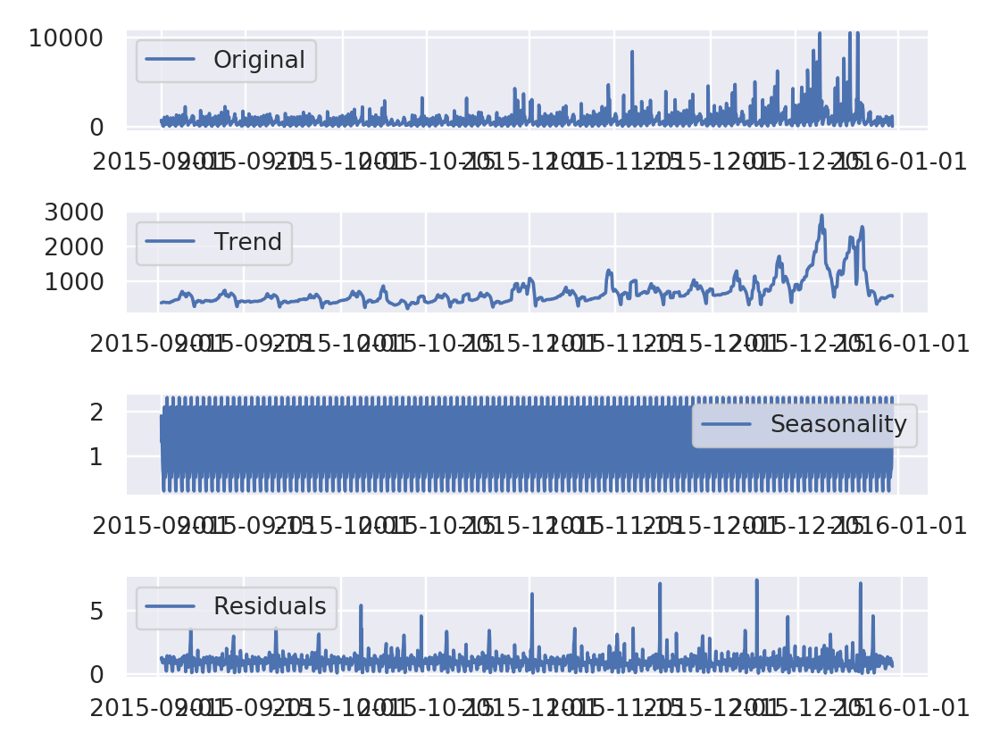
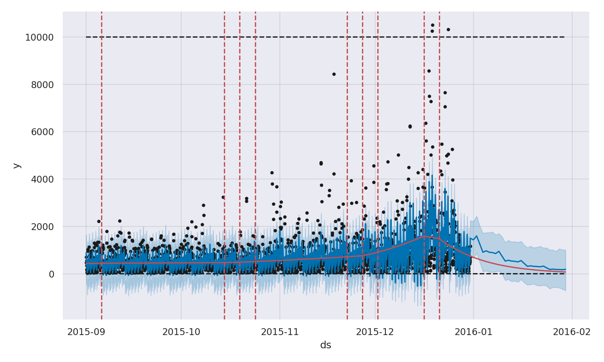
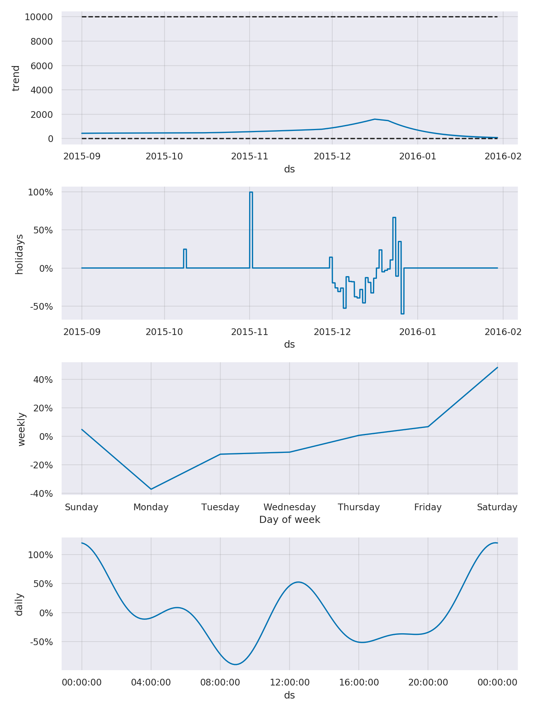
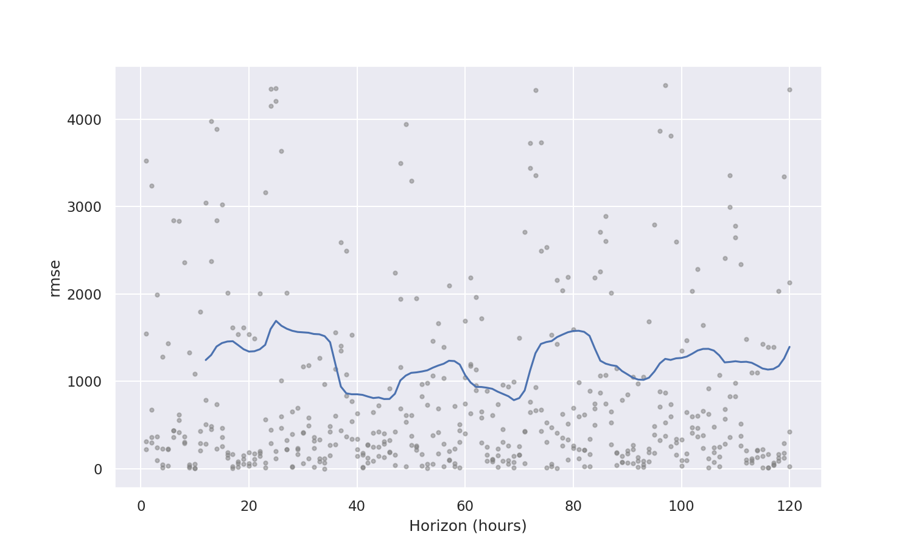

# Taxi Ride Analysis: Forecasting for the city of Lima

This report centralizes the findings of the analysis and modelling of a small 
dataset or panel, of about 2M taxi ride trips, in period of 122 days.

It describes the story of analysing the data, creating a timeseries of trips per 
hour and then attempts to model and predict the future with comon timeseries analysis
techniques. 

It was written in a short timeframe and acts as the overeview of the project.

Much like a table of contents.

The meat of the project lies in the 
[5 Jupyter Notebooks in the `notebooks/` folder](../notebooks).

## Introduction

Taxi ride analysis is an important metric for a company working in the field.
Even more so for hourly trip count forecasting, which is chosen as our analysis centerpoint.

## Setup

The project is an installable package, and organized to help a future analyst
reproduce and extend the results. It was based on:

https://drivendata.github.io/cookiecutter-data-science/

Take a look at `README.md` for a quick tour, installation and usage instuctions.

The detailed analysis lives in the 5 notebooks under `/notebooks` and we'll
get into it right away.

## Exploration and Outliers

The data was first explored and cleaned during the first two notebooks.

Numbers on headers represent the relevant notebooks.

### 0. Load and explore data

[relevant notebook link](../notebooks/00-load-and-data-exploration.ipynb)

Pandas is used throughout the analysis as the container type of choice for our
dataset and timeseries data.

`NaN` values were dropped as they were but a small percentage  (<<0.01) of the data.

#### Locations

First the columns `source_latitude`, `source_longitude` and equivalent two destination
columns were explored.

Starting with a quick boxplot and histogram to find out the std, mean and variance,
helps to start thinking about possible outliers. Quick scatterplots and use of
maps with `folium` (https://python-visualization.github.io/folium/) helped to 
make sure, in a quick and dirty way, that trips were on land and at the right city.

#### Trip counts

After making sure there were not many trips outside the city, the next thing was
to do the same boxplot and histogram for trip counts per day. 

The data spawned for about 122 days.

#### Passenger id's and addresses

Passenger id's were a problem to decipher, as some id's would conduct thousands 
of trips from and to specific addresses, without necessarily going back.

It was concluded that these id's have some special quality, for which the context
is missing, and is no use getting much into.

#### Trip distances

The feature was created introduced to the dataset and explored with the 
same methods (boxplot, histogram) as the rest.

#### Other considerations

There was no time, but a correlation matrix between dataset features was in order at
this point.

### 1. Outlier removal and timeseries exploration
[relevant notebook link](../notebooks/01-outlier-removal-and-timeseries-exploration.ipynb)

This next notebook removed outliers which were under `0.5%` and over `99.5%`
of the range of all numerical values: `lat`, `lon`, `distance` and `trip_counts`
per hour.

Then after switching gear to the  timeseries depicting `trip-counts-per-hour`,
a deliberate graphical exploration revealed the general trend and 2 most 
prevalent seasonalities of the dataset.

## Modeling and Forecasting

### 2. ARIMA forecasting
[relevant notebook link](../notebooks/02-ARIMA-forecasting.ipynb)

This part goes through the ideas of stationality on a dataset and introduces
the basic tests to clear that notion.

Furthermore, autocorrelation and frequency graphs help give an idea of the 
complexity inherent in the timeseries.

After preparing a simple train-test split, an automatic grid search algorithm
was used to determine the three key values for ARIMA.

Choosing the train test split to the unorthodox 99% - 1% happened so as to
try to allow the model to adjust to the extreme trend changes in that final week.

As a standard process forecasts are evaluated in and out of sample with the use of a graph. 
Time did not allow for cross validation for in-sample-predictions.
Then the standardized residual is also evaluated in a qualitative manner. 

The residuals showed that further information was preserved in them, but that happened
most of the time. A qualititive look of the graph revealed that out of sample predictions
did not contained no seasonality whatsoever.

RMSE is used as a metric for out-of-sample predictions. 
The value was not judged as too bad, considering the scale of values: 

- Test RMSE: 545.974

#### Embed seasonality with SARIMA

Next we explore the idea of forecasting seasonality along with trend, using an
automated grid search model trainer, to chose the extra parameters for a proper
SARIMA model forecasting. We allow seasonality to go as far as 24, for computational
ease.

Complicated SARIMA models, along with different parameter testing, lead to long
training times.

The standard procedure of qualitative evaluation through graphs is followed again,
and RMSE is used as the numeric metric for out-of-sample predictions once again.

Residual plots, were worse than the naive approach and although the out-of-sample 
predictions contain strong evidence of seasonality, the RMSE score doubled.

- Test RMSE: 1009.208

On the other hand, the out-of-sample prediction had managed to model the 24-hour 
season cycles we asked for it to model.

### 3. Deseason and revisit ARIMA
[relevant notebook link](../notebooks/03-deseason-timeseries-ARIMA-revisited.ipynb)

Deseasoning is the process of removing seasonality components from a timeseries,
allowing only for the trend to remain. 

As we already are aware from our preliminary exploration, that the data have 2 strong
24h and 7d seasonalities embedded in them. The multiplicative method of deseasoning
was preferred, as it was noticed that freq variations increased in amplitude, when
the trend did the same.

Two consecutive deseasoning operations allow for a clearer form of the trend line,
and we try to model it using a very simple auto-ARIMA model, with minimum seasonality.

Moreover, the fitting time has reduced significantly. 

Evaluating the plot diagnostics of the standardized residuals, did not show much of 
an improvement, but out-of-sample RMSE dropped a further.

- Test RMSE: 183.112

It is worth reminding at this point, that this value was for the mere trend of the timeseries, after
removing the 2 seasonality components.

### 4. Prophet basic
[relevant notebook link](../notebooks/04-Prophet-baseline-on-clean-data.ipynb)

Prophet is a procedure for forecasting time series data based on an additive model 
where non-linear trends are fit with yearly, weekly, and daily seasonality, plus holiday effects. 
It works best with time series that have strong seasonal effects and several seasons of historical data. 

Prophet is robust to missing data and shifts in the trend, and typically handles outliers well.
Running Prophet on the raw data, with NaN's did not seem to make a big difference for the method.

Still the data was relatively clean to begin with, and the cleaned data was preferred for the final
runs, so as to keep a golden standard throughout our experiments.

Cross validation was conducted in sample, showing an average of 1000 for RMSE,
including some fluctuations.

The first run of Prophet, was with the basic settings. It the ease of use, combined with good 
results and intuitive looking plots, that made it stand out. Not only was Prophet accurate,
but also much quicker than SARIMA to train. That allowed for more iterations, while ready to use
tools allowed also for a cross validation of the model.

### 5. Prophet revisited
[relevant notebook link](../notebooks/05-Prophet-revisited-%20with-holidays-and-multiplicative-seasoning-on-clean-data.ipynb)
 
 The final iteration with Prophet was more elaborate. 
 
 Qualities like use of logistic (instead of linear) growth and use multiplicative  
 (instead of additive) seasonality, to model both trend and seasonality allowed
 for more room.
 
 Quick experiments were made with model parameters to allow for more flexibility and
 changepoints for the trend. Prophet allows for setting up holidays, where the model
 is allowed to deviate a lot from it's trend, in order to support them.
 
 
 
 So Christmas season and Christmas day were introduced as holidays, 
 along with 14 Peruvian holidays, two of which occured during that period and excibit
 a spike in actual and modelled trip counts.
 
 Moreover both 24h and 7d prevalent seasonalities were detected.
 
 
 
 A floor of 0 was also stated, as it is impossible to have negative trips, and also
 a ceiling of 10000 trips per day. These two cuttoffs are respected by the model's trend
 and it does not surpass them.
 
 You can see them as dashed lines in the first plot in this section.
 
 Cross validation happened in-sample, where RMSE ranged around 1000, with less 
 fluctuations that the basic model.
 
 
 
 Validation periods were 5 days long, with 15 day intervals between them, 
 starting only after the first 60 days of data.
 
## Conclusions
 
 In this analysis we showed several methods and tools that can help to model a 
 timeseries. After the initial data exploration and outlier removal, ARIMA was 
 introduced, as a naive and a SARIMA modelling tool, with interesting results.
 
 Then we used decomposition to examine how ARIMA would model a cleaned up trend from
 it's strongest seasonality coefficients, and indeed that went well.
 
 Finally we experimented with the Prophet model, which surprised with it's features,
 speed, ease of use and accuracy.
 
 

 
